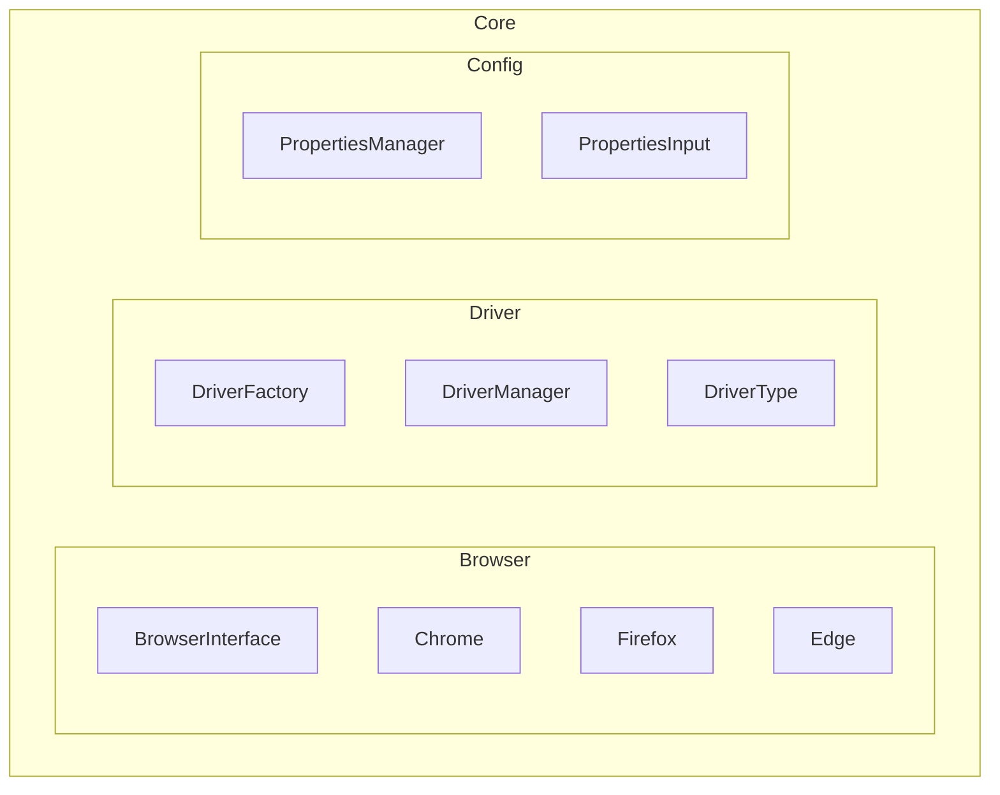

# :rocket: Selenium Automation Framework

Automation testing framework built using **Java**, **Selenium**, **TestNG**, **Cucumber**, and **Gradle**.

This project demonstrates how to build a UI automation framework from scratch using clean
architecture, clear separation of responsibilities, and well-known design patterns.

---

<h1>Table of contents</h1>

- [:open_file_folder: 1. Project](#open_file_folder-1-project)
    - [:bookmark: 1. Introduction](#bookmark-1-introduction)
    - [:dart: 2. Architecture Goals](#dart-2-architecture-goals)
- [:card_file_box: 2. Project Structure](#card_file_box-2-project-structure)
    - [:triangular_ruler: 1. High-Level Structure](#triangular_ruler-1-high-level-structure)
- [:gear: 3. Design Patterns](#gear-3-design-patterns)
    - [:repeat: 1. Strategy Pattern (Browser Abstraction)](#repeat-1-strategy-pattern-browser-abstraction)
    - [:factory: 2. Factory Pattern (DriverFactory)](#factory-2-factory-pattern-driverfactory)
    - [:lock: 3. Singleton Pattern (DriverManager)](#lock-3-singleton-pattern-drivermanager)
- [:wrench: 4. Configuration Management](#wrench-4-configuration-management)
    - [:key: 1. PropertiesInput Enum](#key-1-propertiesinput-enum)
    - [:clipboard: 2. PropertiesManager](#clipboard-2-propertiesmanager)
    - [:computer: 3. Command-Line Execution Example](#computer-3-command-line-execution-example)
- [:balance_scale: 5. Design Principles Applied](#balance_scale-5-design-principles-applied)
- [:books: 6. Documentation Standards](#books-6-documentation-standards)
    - [:scroll: 1. Git Commit Conventions](#scroll-1-git-commit-conventions)
    - [:memo: 2. JavaDoc Conventions](#memo-2-javadoc-conventions)
- [:sparkles: 7. Key Features](#sparkles-7-key-features)

---

## :open_file_folder: 1. Project

### :bookmark: 1. Introduction

This framework was built to demonstrate how to design and implement a scalable and maintainable UI
automation framework using Java and Selenium.

### :dart: 2. Architecture Goals

The framework is designed to be:

- Scalable
- Maintainable
- Extensible
- Cleanly separated by responsibility

<div align="right">
  <strong>
    <a href="#table-of-contents" style="text-decoration: none;">↥ Back to top</a>
  </strong>
</div>

---

## :card_file_box: 2. Project Structure

### :triangular_ruler: 1. High-Level Structure



<div align="right">
  <strong>
    <a href="#table-of-contents" style="text-decoration: none;">↥ Back to top</a>
  </strong>
</div>

---

## :gear: 3. Design Patterns

### :repeat: 1. Strategy Pattern (Browser Abstraction)

Each browser implements a common interface:

```java
public interface Browser {

  WebDriver getBrowser();
}
```

Example implementation:

```java
public class Chrome implements Browser {

  @Override
  public WebDriver getBrowser() {
    WebDriverManager.chromedriver().setup();
    return new ChromeDriver();
  }
}
```

Benefits:

- Easy browser extension
- Open/Closed Principle applied
- Decoupled browser logic

<div align="right">
  <strong>
    <a href="#table-of-contents" style="text-decoration: none;">↥ Back to top</a>
  </strong>
</div>

---

### :factory: 2. Factory Pattern (DriverFactory)

Driver creation is centralized:

```java
public static WebDriver getDriverManager(final DriverType driverType) {
  Browser browser = BROWSERS.get(driverType);
  return browser.getBrowser();
}
```

Benefits:

- Single place for driver instantiation
- Reduced coupling
- Easier maintenance

<div align="right">
  <strong>
    <a href="#table-of-contents" style="text-decoration: none;">↥ Back to top</a>
  </strong>
</div>

---

### :lock: 3. Singleton Pattern (DriverManager)

Ensures only one WebDriver instance:

```java
public WebDriver getDriver() {
  if (driver == null) {
    initDriver();
  }
  return driver;
}
```

Responsibilities:

- Driver initialization
- Window maximize
- Explicit wait configuration
- Driver cleanup

<div align="right">
  <strong>
    <a href="#table-of-contents" style="text-decoration: none;">↥ Back to top</a>
  </strong>
</div>

---

## :wrench: 4. Configuration Management

### :key: 1. PropertiesInput Enum

```java
public enum PropertiesInput {
  BROWSER("browser"),
  BASE_URL("baseUrl"),
  EXPLICIT_WAIT("explicitWait");
}
```

### :clipboard: 2. PropertiesManager

```java
public String getProperty(PropertiesInput key) {
  String systemValue = System.getProperty(key.getPropertiesName());
  return systemValue != null ? systemValue : properties.getProperty(key.getPropertiesName());
}
```

This allows configuration to be read from:

- Command-line parameters
- `gradle.properties` (default values)


### :computer: 3. Command-Line Execution Example

Run tests with a specific browser:

```bash
gradle test -Dbrowser=firefox
```

If no parameter is provided, the value defined in `gradle.properties` will be used.

<div align="right">
  <strong>
    <a href="#table-of-contents" style="text-decoration: none;">↥ Back to top</a>
  </strong>
</div>

---

## :balance_scale: 5. Design Principles Applied

- Single Responsibility Principle (SRP)
- Open/Closed Principle (OCP)
- Dependency Inversion Principle (DIP)

<div align="right">
  <strong>
    <a href="#table-of-contents" style="text-decoration: none;">↥ Back to top</a>
  </strong>
</div>

---

## :books: 6. Documentation Standards

Project documentation is centralized in the `/docs` folder to keep the README clean and focused.

### :scroll: 1. Git Commit Conventions

Commit message standards based on **Conventional Commits** are defined here:

➡️ [`docs/GIT_CONVENTIONS.md`](docs/GIT_CONVENTIONS.md)

This document explains:
- Commit message format
- Allowed types and scopes
- Good and bad examples
- Why these conventions are used

<div align="right">
  <strong>
    <a href="#table-of-contents" style="text-decoration: none;">↥ Back to top</a>
  </strong>
</div>

---

### :memo: 2. JavaDoc Conventions

Java documentation standards are defined here:

➡️ [`docs/JAVADOC_CONVENTIONS.md`](docs/JAVADOC_CONVENTIONS.md)

This document explains:
- How to document classes, methods, and enums
- When to use `{@inheritDoc}`
- Naming rules and documentation best practices

<div align="right">
  <strong>
    <a href="#table-of-contents" style="text-decoration: none;">↥ Back to top</a>
  </strong>
</div>

---

## :sparkles: 7. Key Features

- Browser abstraction using Strategy Pattern
- Centralized driver management
- Configurable execution via command line or properties file
- Clean architecture
- Easy to extend and maintain

<div align="right">
  <strong>
    <a href="#table-of-contents" style="text-decoration: none;">↥ Back to top</a>
  </strong>
</div>

---
