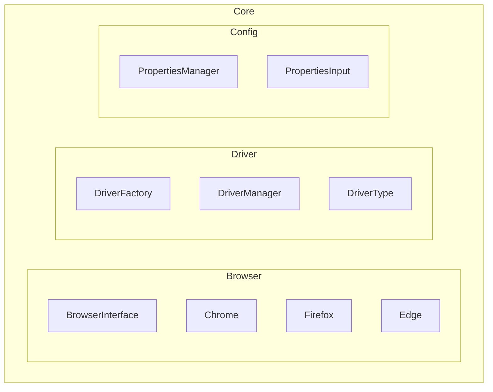

# Selenium Automation Framework

Automation testing framework built using **Java**, **Selenium**, **TestNG**, **Cucumber**, and **Gradle**.

This project shows how to create an automation framework from scratch using clean structure and common design patterns.

------------------------------------------------------------------------

## Architecture Overview

The framework is designed to be:

-   Scalable
-   Maintainable
-   Extensible
-   Cleanly separated by responsibility

Main responsibilities are separated into:

- Browser implementations
- Driver management
- Configuration management

------------------------------------------------------------------------

## Project Structure

------------------------------------------------------------------------

## Design Patterns Used

### Strategy Pattern

Each browser implementation represents a strategy:

-   Chrome
-   Firefox
-   Edge

Benefits:

-   Easy browser extension.
-   Open/Closed Principle applied.
-   Decoupled browser logic.

------------------------------------------------------------------------

### Factory Pattern

`DriverFactory` creates WebDriver instances in one place.

Benefits:

-   Single place to manage driver instantiation.
-   Simplifies adding new browsers.
-   Reduces coupling.

------------------------------------------------------------------------

### Singleton Pattern

`DriverManager` ensures a single `WebDriver` instance during test
execution.

Features:

-   Lazy initialization.
-   Central driver control

------------------------------------------------------------------------

### Configuration Pattern

`PropertiesManager` reads configuration from:

-   `gradle.properties`
-   `System properties`

Supports environment-based execution without code changes.

------------------------------------------------------------------------

## Key Features

-   Browser abstraction layer
-   Configurable browser execution
-   Centralized driver management
-   Clean project structure
