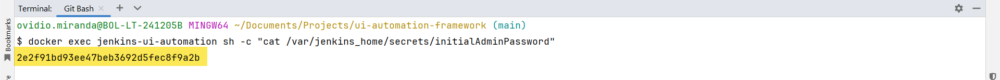
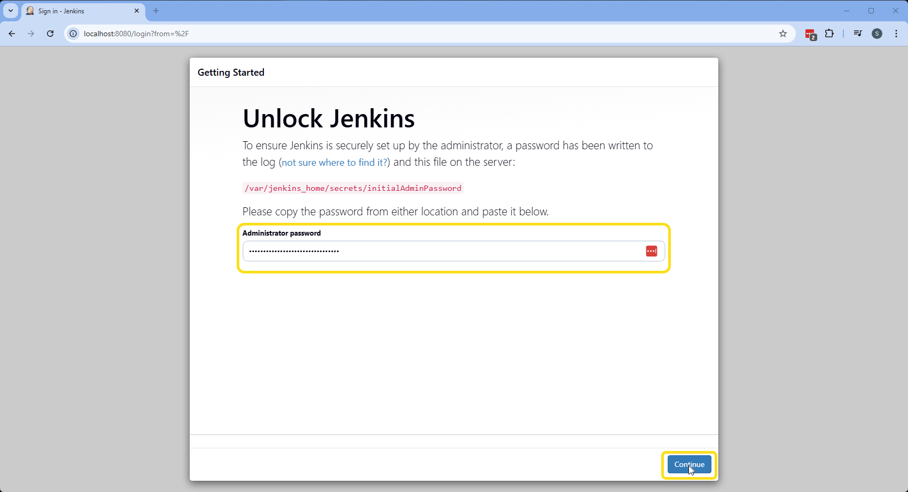
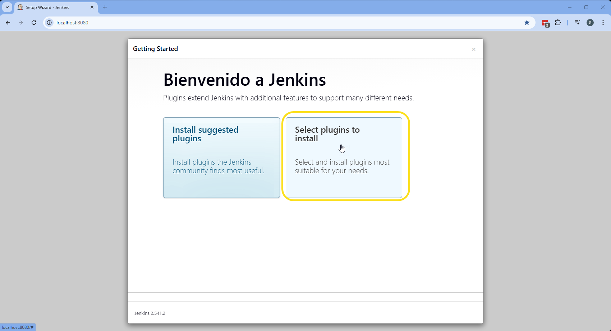
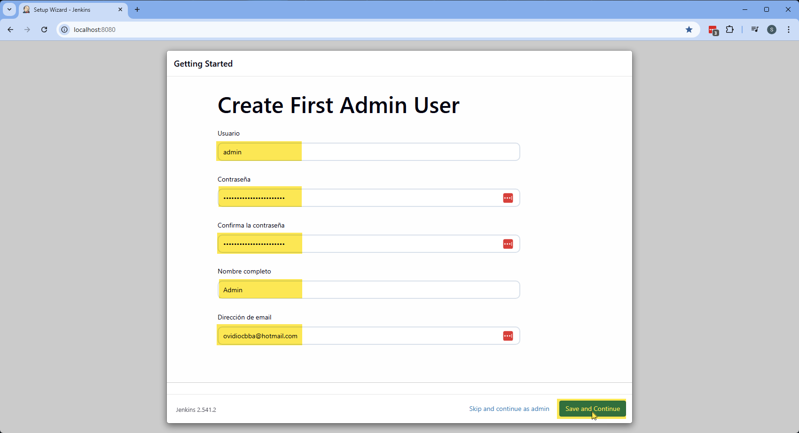
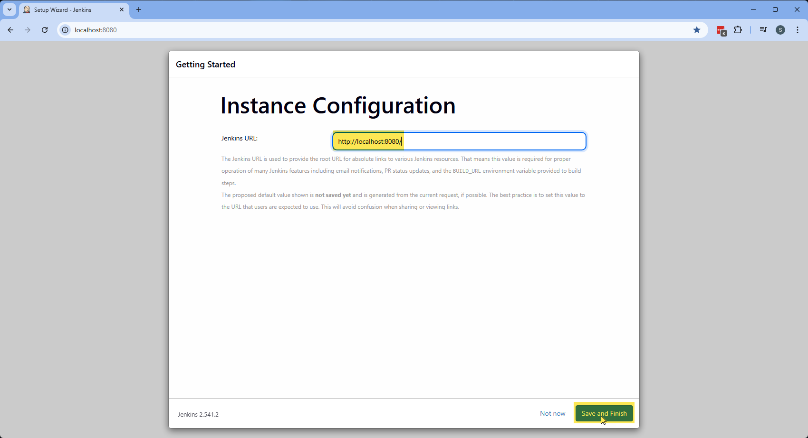
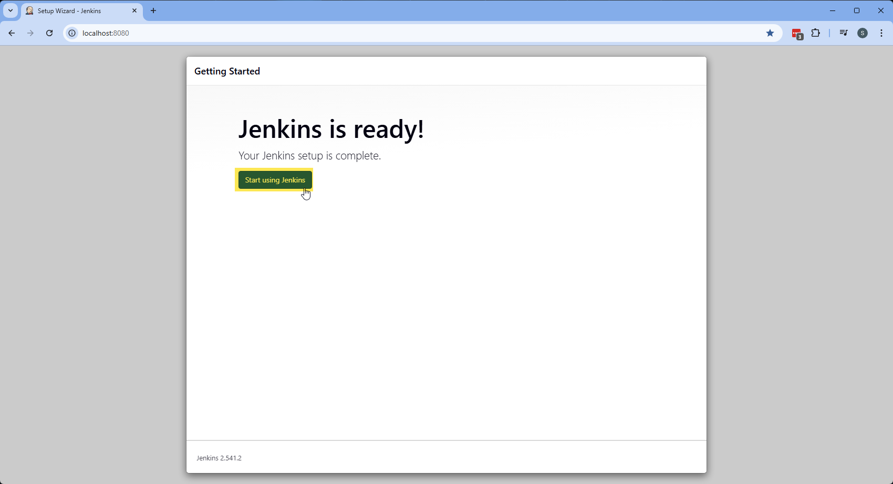
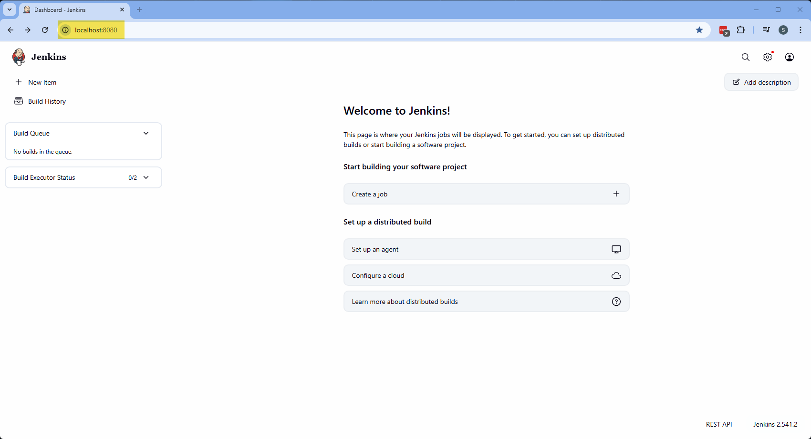

# 🚀 Jenkins Setup with Docker

This guide explains how to build and run a fully configured **Jenkins UI Automation Server** using Docker with persistent storage and browser support.

---

<h1>Table of contents</h1>

* [:whale: 1. Build Docker Image](#whale-1-build-docker-image)
* [:floppy_disk: 2. Create Persistent Volume](#floppy_disk-2-create-persistent-volume)
* [:rocket: 3. Run Jenkins Container](#rocket-3-run-jenkins-container)
* [:globe_with_meridians: 4. Access Jenkins](#globe_with_meridians-4-access-jenkins)
* [:key: 5. Get Initial Admin Password](#key-5-get-initial-admin-password)
* [:gear: 6. Initial Jenkins Setup](#gear-6-initial-jenkins-setup)
* [:wastebasket: 7. Clean Setup (Optional)](#wastebasket-7-clean-setup-optional)
* [:memo: 8. Notes](#memo-8-notes)

---

## 🐳 1. Build Docker Image

The `Dockerfile` is located at:

```
ui-automation-framework/Dockerfile
```

If you are inside the `ui-automation-framework` folder, you can run

```bash
docker build -t jenkins-automation-ci:1.1.0 .
```

Builds a custom Jenkins image with the required plugins.

### 🔧 This image includes:

* Java 17
* Google Chrome
* Mozilla Firefox
* Microsoft Edge
* Xvfb (virtual display)
* Allure CLI
* Required Jenkins plugins

<div align="right">
  <strong>
    <a href="#table-of-contents">↥ Back to top</a>
  </strong>
</div>

---

## 💾 2. Create Persistent Volume

```bash
docker volume create jenkins_automation_ci
```

This volume stores:

* Jenkins configuration
* Jobs
* Plugins
* Allure history
* Credentials

⚠ Data persists even if the container is removed.

<div align="right">
  <strong>
    <a href="#table-of-contents">↥ Back to top</a>
  </strong>
</div>

---

## 🚀 3. Run Jenkins Container

```bash
docker run -d \
  --name jenkins-ui-automation \
  --restart unless-stopped \
  -p 8080:8080 \
  -p 50000:50000 \
  -v jenkins_automation_ci:/var/jenkins_home \
  --shm-size=2g \
  jenkins-automation-ci:1.1.0
```

### 🔎 What each option does:

| Option                     | Description                           |
| -------------------------- | ------------------------------------- |
| `--restart unless-stopped` | Auto-restart if container crashes     |
| `8080`                     | Jenkins UI                            |
| `50000`                    | Jenkins agent communication           |
| `-v`                       | Persistent Jenkins data               |
| `--shm-size=2g`            | Prevent Chrome/Edge crashes in Docker |

<div align="right">
  <strong>
    <a href="#table-of-contents">↥ Back to top</a>
  </strong>
</div>

---

## 🌍 4. Access Jenkins

Open your browser:

```
http://localhost:8080/
```

<div align="right">
  <strong>
    <a href="#table-of-contents">↥ Back to top</a>
  </strong>
</div>

---

## 🔑 5. Get Initial Admin Password

### PowerShell

```powershell
docker exec jenkins-ui-automation cat /var/jenkins_home/secrets/initialAdminPassword
```

### Git Bash / Bash

```bash
docker exec jenkins-ui-automation sh -c "cat /var/jenkins_home/secrets/initialAdminPassword"
```



Copy the generated password and paste it into the Jenkins unlock screen.



<div align="right">
  <strong>
    <a href="#table-of-contents">↥ Back to top</a>
  </strong>
</div>

---

## ⚙ 6. Initial Jenkins Setup

### 6.1 Plugin Installation

Since plugins are already installed via Dockerfile:

Select:

```
Select plugins to install
```



Then choose:

```
None
```

Click **Install**.


No need to install suggested plugins again.

---

### 6.2 Create First Admin User

Fill the form:

| Field            | Value                  |
| ---------------- | ---------------------- |
| Username         | `admin`                |
| Password         | (your secure password) |
| Confirm Password | (same password)        |
| Full Name        | `Admin`                |
| Email Address    | your email             |



Click **Save and Continue**.

---

### 6.3 Instance Configuration

Keep the default URL:

```
http://localhost:8080/
```

Click:

```
Save and Finish
```



Then click:

```
Start using Jenkins
```



---

✅ Jenkins is now ready to use.



<div align="right">
  <strong>
    <a href="#table-of-contents">↥ Back to top</a>
  </strong>
</div>

---

## 🗑 7. Clean Setup (Optional)

Remove container:

```bash
docker rm -f jenkins-ui-automation
```

Remove volume:

```bash
docker volume rm jenkins_automation_ci
```

⚠ This will permanently delete all Jenkins data.

<div align="right">
  <strong>
    <a href="#table-of-contents">↥ Back to top</a>
  </strong>
</div>

---

## 📝 8. Notes

* The Docker volume ensures Jenkins data persists.
* Use `--shm-size=2g` to prevent browser crashes.
* Always use strong credentials in real environments.
* This setup is optimized for UI Automation execution with Selenium and Allure reporting.

<div align="right">
  <strong>
    <a href="#table-of-contents">↥ Back to top</a>
  </strong>
</div>

---
