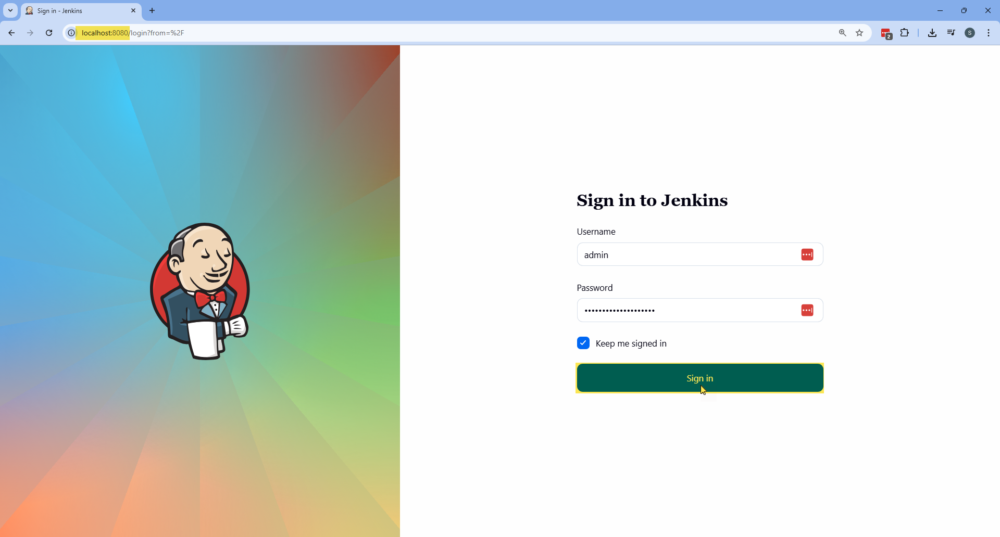

# 🚀 Jenkins Setup with Docker

This guide explains how to build and run a fully configured **Jenkins UI Automation Server** using Docker with persistent storage and browser support.

---

<h1>Table of contents</h1>

* [:whale: 1. Build Docker Image](#whale-1-build-docker-image)
* [:floppy_disk: 2. Create Persistent Volume](#floppy_disk-2-create-persistent-volume)
* [:rocket: 3. Run Jenkins Container](#rocket-3-run-jenkins-container)
* [:gear: 4. Initial Jenkins Setup](#gear-4-initial-jenkins-setup)
* [:wastebasket: 5. Clean Setup (Optional)](#wastebasket-5-clean-setup-optional)
* [:memo: 6. Notes](#memo-6-notes)

---

## :whale: 1. Build Docker Image

The `Dockerfile` is located at:

```
ui-automation-framework/Dockerfile
```

If you are inside the `ui-automation-framework` folder, you can run

```bash
docker build --no-cache -t jenkins-automation-ci:1.1.0 .
```

Builds a custom Jenkins image with the required plugins.

### 🔧 This image includes:

* Java 17
* Google Chrome
* Mozilla Firefox
* Microsoft Edge
* Xvfb (virtual display)
* Allure CLI
* Required Jenkins plugins

<div align="right">
  <strong>
    <a href="#table-of-contents">↥ Back to top</a>
  </strong>
</div>

---

## :floppy_disk: 2. Create Persistent Volume

```bash
docker volume create jenkins_automation_ci
```

This volume stores:

* Jenkins configuration
* Jobs
* Plugins
* Allure history
* Credentials

⚠ Data persists even if the container is removed.

<div align="right">
  <strong>
    <a href="#table-of-contents">↥ Back to top</a>
  </strong>
</div>

---

## :rocket: 3. Run Jenkins Container

```bash
docker run -d \
  --name jenkins-ui-automation \
  --restart unless-stopped \
  -p 8080:8080 \
  -p 50000:50000 \
  -v jenkins_automation_ci:/var/jenkins_home \
  -e JENKINS_ADMIN_ID=admin \
  -e JENKINS_ADMIN_PASSWORD=SuperSecurePass2026! \
  --shm-size=2g \
  jenkins-automation-ci:1.1.0
```
**Note**: 

Be sure to change the default password `SuperSecurePass2026!` to a password you choose. This will help keep your Jenkins secure before using it. 
The password you set here will be used for the Jenkins admin login during the first setup.

### 🔎 What each option does:

| Option                     | Description                           |
| -------------------------- | ------------------------------------- |
| `--restart unless-stopped` | Auto-restart if container crashes     |
| `8080`                     | Jenkins UI                            |
| `50000`                    | Jenkins agent communication           |
| `-v`                       | Persistent Jenkins data               |
| `--shm-size=2g`            | Prevent Chrome/Edge crashes in Docker |

<div align="right">
  <strong>
    <a href="#table-of-contents">↥ Back to top</a>
  </strong>
</div>

---

## :gear: 4. Initial Jenkins Setup

### 4.1 Plugin Installation
Open the default URL:

```
http://localhost:8080/
```

When you first access Jenkins, you will be prompted to log in. 
Use the credentials specified in the environment variables (`JENKINS_ADMIN_ID` and `JENKINS_ADMIN_PASSWORD`) to access Jenkins.



Since plugins are already installed via Dockerfile:

Select:

```
Select plugins to install
```


Then choose:

```
None
```

Click **Install**.


No need to install suggested plugins again.

---

### 4.2 Instance Configuration

Click:

```
Save and Finish
```


Then click:

```
Start using Jenkins
```


---

✅ Jenkins is now ready to use.


<div align="right">
  <strong>
    <a href="#table-of-contents">↥ Back to top</a>
  </strong>
</div>

---

## :wastebasket: 5. Clean Setup (Optional)

Remove container:

```bash
docker rm -f jenkins-ui-automation
```

Remove volume:

```bash
docker volume rm jenkins_automation_ci
```

⚠ This will permanently delete all Jenkins data.

<div align="right">
  <strong>
    <a href="#table-of-contents">↥ Back to top</a>
  </strong>
</div>

---

## :memo: 6. Notes

* The Docker volume ensures Jenkins data persists.
* Use `--shm-size=2g` to prevent browser crashes.
* Always use strong credentials in real environments.
* This setup is optimized for UI Automation execution with Selenium and Allure reporting.

<div align="right">
  <strong>
    <a href="#table-of-contents">↥ Back to top</a>
  </strong>
</div>

---
